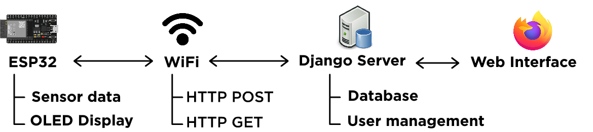

# EcoMonitor Firmware
This repository is a part of the EcoMonitor project. This repository contains the source code for the ESP32 firmware, used to get sensor readings and communicate with Django server. 

# About The EcoMonitor Project
This project is about making devices that read environmental data, such as temperature, humidity, and send it to a dedicated server, which allows users to get their stats.

Tech stack:
* ESP32 DevKit V1 boards for the device core, programmed using PlatformIO.
* Django as the webserver
* REST API for communicating between ESP and Django
* PostgreSQL for database

Other repositories:
https://github.com/galukosi/ecomonitor for Django web server



# How it works

The firmware is designed to be extensible. Developers can add their new device types with custom sensor logic, without modifying the API structure. 
`src/devices` directory contains C++ files for initializing device information, such as name, measurement unit, etc. Sensors are implemented in `src/ecomonitor/sensors/`. Each sensor module must return a `final_value`. 

## General device logic:
1. **Initialize access point for configuring**. The user has to join the local website using the instructions on the OLED screen, and enter the Wi-Fi credentials to connect the ESP to the internet.
2. **Sensor readings**. Once the device is connected to the internet, it begins to measure sensor readings every 5 seconds. These readings are displayed on the screen, locally. After some time(default, 15 minutes), it sends the sensor readings to the API. API link is defined in every device file e.g., `src/devices/GasGuard.cpp`. 

Example HTTP POST request:
```http request
POST /sensor-readings/ HTTP/1.1
Host: ecomonitor.t-corp.com
Content-Type: application/json
Content-Length: <auto>

{
    "device_id": "GG-A5080894",
    "final_value": 0.23
}
```

3. **Commands**. If a user sends a command to the Django server, it's stored in the database. And on every HTTP POST request, the queried commands are sent to the HTTP response. Device handles it and executes. 

Example HTTP response that contains a command:
```json
{
  "command": "change_reading_time",
  "payload": "15"
}
```
This will change the reading time interval to 15 minutes and write it to NVS.

4. **Device ID**. Every device generates its unique ID, using the `generateDeviceID()` function. This function uses a prefix defined in device config file, and connects the last 32 bits of the MAC address in hexadecimal format. The server uses the `device_id` prefix to identify device type (e.g., `GG-` for GasGuard) and fill related information automatically.

# Installation
## Requirements:
1. **ESP32 DevKit V1** board with connections according to the device's scheme you want to flash. You can find the schemes in `misc/schemes`.
2. PlatformIO installed (CLI or VS Code extension).

## Steps:
### 1. Clone the repository

```bash
git clone https://github.com/galukosi/ecomonitor-firmware.git
cd ecomonitor-firmware
```

### 2. Configuration
Edit configuration for PIO project in `platformio.ini`. You may want to set `build_flags` to the device model you want to use. You also can change the upload port and upload speed.
```ini
; Select device type (choose ONE and replace DEVICETYPE)
; GASGUARD
; HUMIDGUARD
; TEMPGUARD
build_flags = -D DEVICETYPE

; Upload settings
upload_port = COM4
monitor_speed = 115200
upload_speed = 115200
```


### 3. Flash the firmware
In your terminal, run:
```bash
pio run -t upload -e esp32dev
```